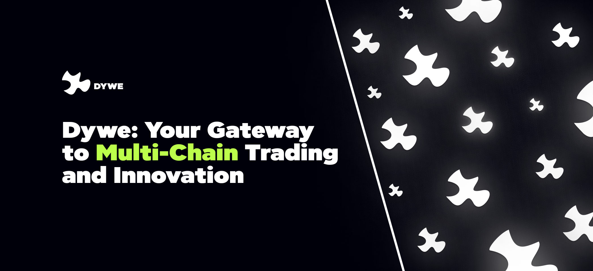

Dywe - Revolution in Trading: The First Multichain Exchange in the TON Ecosystem! We provide a wide range of user-friendly trading tools that make your experience on the platform not only enjoyable, but also as efficient as possible.

At Dywe, you can not only explore the world of futures trading, but also use it for NFT and tokens. Discover the exciting possibilities of trading futures on unique digital assets and tokens. Our advanced features give you complete control and convenience, allowing you to easily manage your investments and optimise your strategy.

With Dywe's powerful tools and advanced functionality, you can develop and test your own strategies, adapt them to current market conditions and track results in real time. Access innovative features such as NFT and token futures trading, liquidity pooling, copy trading, demo trading and use them to maximise your asset management.

Discover new horizons of financial independence and confidence in your decisions. Working with Dywe, you create a strategy that suits your needs and enjoy trading to the fullest. Start your journey to successful decentralised trading with Dywe today and take a step towards financial freedom and efficiency!